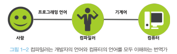
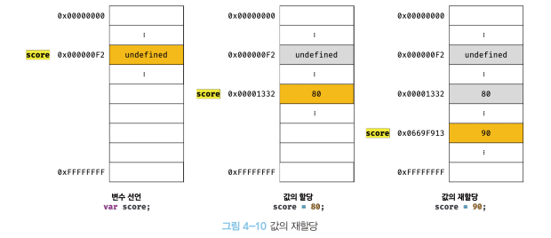

# **자바스크립트 잠수함 시리즈1**

> # **1.프로그래밍?**

## **1.1 프로그램밍이란?**

> ### 인간이 컴퓨터에서 말하는 커뮤키네이션 방식

우리의 컴퓨터는 한 우물만 기똥차게 잘파는 아이다.
우리는 이 아이에게 뭔가 일을 시킬 때 하나하나 상세하게 알려줄 의무가 있다.
예를들어 컴퓨터에게 물건을 옮기길 부탁할경우 물건의 크기, 물건을 어디에서 어디로 옮길지에 대한 정확한 자표, 물건을 집어 올릴때 팔의 각도와 자세하고 **상세한 요구사항들을 설명할 줄 알아야한다.**

## **1.2 프로그래밍 언어**

> ### 사람과 컴퓨터 (인터프리터, 컴파일러) 모두가 이해할 수 있는 약속된 형태의 인공어

<p align="center"></p>

컴퓨터의 언어 방식은 마치 영화 메트릭스에서 보이는 것과같은 모습을 보인다

<p align="center"></p>

컴퓨터는 **컴파일러** 또는 **인터프리터** 라는 번역기를 가지고 있다. 이를통해 프로그래밍 언어를 기계어로 변환한다.

> ### 프로그래밍 언어는 **구문**와 **의미**의 조합으로 표현된다

## **1.2 구문과 의미 **

# 1장 프로그래밍

# 1.1 프로그래밍이란?

컴퓨터에게 실행을 요구하는 일종의 **커뮤니케이션**

프로그래밍을 위해선 **요구사항**을 명확히 이해한 후 **해결방안을 정의**할필요있음

이때 요구되는것이 **문재해결능력**

문재해결능력에는 문제를 분해하고 정보를 구분해야하며 행위를 배열할줄 알아야함

프로그램밍 = 멍청한 컴퓨터가 할 수 있게끔 하는 **정확하고 상세한 요구사항을 설명하는 작업** = 코드

# 1.2 프로그래밍 언어

컴파일러, 인터프리터 = 프로그램언어를 기계어로 변환

프로그래밍 언어는 **구문과 의미**의 조합

# 1.3구문과 의미

프로그래밍 언어를 익히는 과정은 외국어를 익히는 과정과 유사하다.
그렇기에 문법을 잘 안다 할지라도 외국어를 잘하는 것은 아닌다.
그렇게 **문법에 맞는 문장**을 구성하고 **의미**또한 지니고 있어야 언어를 사용한다고 할 수 있다.

#### **예시**

```jsx
const number = "String";
console.log(nubmer * number); //NaN
```

문법적으로 틀리지 않더라도 아무 의미가 없는 코드가 탄생

저자가 말하는 프로그래밍 프로그래밍이란

> **_요구사항의 집합을 분석해서 적절한 자료구조와 함수의 집합으로 변환한 후, 그 흐름을 제어하는것_**

> # **2.변수**

## **2.1 변수란?**

> **하나의 값을 저장하기 위해 확보한 메모리공간 자체 또는 그 메모리 공간을 식별하기 위해 붙인 이름**

```jsx
10 + 20;
```

위의 내용을 처리할 때 사람은 계산과 기억을 모두 두뇌에서 하지만 컴퓨터는 연산과 기억을 수행하는 부품이 나눠져 있다.
**cpu를 통해 연산**을 하고 **메모리를 통해 데이터를 기억**한다

<p align="center"></p>

프로그래밍 언어는 기억하고 싶은 값을 메모리에 저장하고, 저장된 값을 읽어 들여 **재사용하기 위해 변수**라는 메커니즘 제공한다.

## **2.2 식별자**

> **어던값을 구별해서 식별할 수 있는 고유한 이름**

값은 메모리 공간에 저장도이고 있다. 식별자는 메모리 공간에 저장되어 있는 어떤 값을 알아낼수 있어야한다. 이를 위해 식별자는 어떤 값이 저장되어 있는 메모리 주소를 기억(저장)해야 한다.

<p align="center"></p>

- 식별자는 값 30이 저장되어 있는 메모리 주소 0x066f913을 기억해내고 그 주소와 매핑관계를 맺으며 메모리에 저장된다.

> **_식별자는 값이 아니라 메모리 주소를 기억하고 있다_**

## **2.3 변수선언**

> **값을 저장하기 위한 메모리 공간을 확보하고 변수이름과 확보된 메모리 공간의 주소를 연결해서 값을 저장할수 있게 준비하는것**

변수를 사용하려면 반드시 선언이 필요하고 선언할때에는 **var, let, const** 키워드를 사용한다

```jsx
var a;
let b;
const c;
```

<p align="center"></p>

- 확보된 메모리공간에 값이 할당되지 않을 경우 js는 undefined를 할당한다

- var을 이요한 변수 선언은 **선언단계**와 **초기화단계**가 동시에 진행된다
  1. 변수이름 score등록
  1. 초기화 단계를 통해 undefined 할당해 초기화

---

> ### **변수이름은 어디에 등록되는가?**

- 모든 식별자는 실행 컨텍스트에 등록된다
- 변수값은 key/value형식인 객체로 등록되어 관리된다
  > **실행콘텍스트??**
  >
  > - 자바스크립트 엔진이 소스코들을 평가하고 실행하기 위해 필요한 환경을 제공하고 코드의 실행결과를 실제로 관리하는 영역
  > - 자바스크립트 엔진은 실행 컨텍스트를 통해 식별자와 스코프를 관리한다

---

## **2.4 변수 선언의 실행 시점과 변수 호이스팅**

```jsx
console.log(score); // undefined
var scroe;
```

1. **변수선언시점**

   자바스크립트는 인터프리터에 의해 한줄씩 순차적으로 진행을 한다. 그렇다면 위의 코드의 경우 참조에러가 나와야하지만 그렇지 않고 undefined가 출력이 된다
   그이유는 **_*변수선언이 소스코드가 순차적으로 실행되는 시점(런타임)이 아니라 그 이전 단계에서 먼저 실행 되기 때문이다*_**

2. **호이스팅**

   js는 실행하기 앞써 소스코드의 평과과정을 거쳐 소스코드를 실행할 준비를 한다 그 순서는 아래와같다

   1. 소스코드 평가 과정에서 모든 선언무을 소스코드에서 찾아내 먼저 실행
   2. 자바스크립트 엔진은 변수 선언이 위치와 상관없이 다른 코드보다 먼저 실행
   3. 따라서 어떤 위치에 있던 변수를 참조하는것이 가능

   소스코드의 평과 가정이 끝나면 순차적으로 실행한다.

   **_*이처럼 변수 선언문이 코드의 선두로 끌어 올려진것처럼 동작하는 자바스크립트 고유의 특징이 호이스팅이다*_**

## **2.5 값의 할당**

변수 선언은 소스코드가 실행되는 시점인 런타임 이전에 실행되지만 값의 할당은 소스코드가 순차적으로 실행되는 시점인 런타임에서 실행된다

## **2.6 값의 재할당**

```jsx
var score = 80; //변수 선언과 값의 할당
score = 90; // 값의 재할당
```

var키워드로 선언한 변수는 선언과 동시에 udefined로 초기화 되기 때문에 재할당이 된다.

**_*만약 값을 재할당 할수 없어 변수에 저장된 값을 변경할 수 없다면 변수가 아니라 상수라 한다*_**

<p align="center"></p> 
  - 자바스크립트의 경우 어떤 식별자와 연결되어 있지않은 메모리들은  가비지 콜렉터에 의해 메모리에서 자동으로 삭제된다

---

> ### **가바지 콜렉터란?**
>
> 에플리케이션이 할당한 메모리 공간을 주기적으로 검사하여 더이상 사용되지 않은 메모리(위의 경우 1번째 undefined, 2번째 80) 해제하는 기능

- 자바스크립트의 경우 가비지 콜렉터를 내장하고 있는 매니지드 언어이다
  > **매니지드 언어와 언매니지드 언어**
  >
  > - 언매니지드 언어
  >   - 메모리제어를 개발자가 주도할수 있어서 개발자의 역량에 따라 최적의 성능이 가능하나 그 반대의 경우 치명적인 오류발생
  > - 매니지드 언어
  >   - 메모리 관리를 언어차원에서 관리
  >   - 개발자의 직접적인 제어 허용x
  >   - 가비지콜렉터 수행 → 성능면서에서 언매니지드 언어비해 떨어짐

---

## **2.7 식별자 네이밍 규칙**

- 식별자는 특수문자를 제외한 문자, 숫자, 언더스코어,달러기호를 포함할 수 있다
- 단 식별자는 특수문자를 제외한 문자, 언덧코어,달러기호로 시작해야한다. 숫자로 시작하는것은 허용하지 않는다
- 예약어는 식별자로 활용될수 없다

> 네이밍 컨벤션 : 가독성을 높이기 위한 명명규칙

```jsx
//카멜케이스
var firstName;

//파스칼 케이스
var FirstName;
```

일반적으로 변수, 함수 = 카멜케이스

생성자함수, 클래스 = 파스칼케이스
